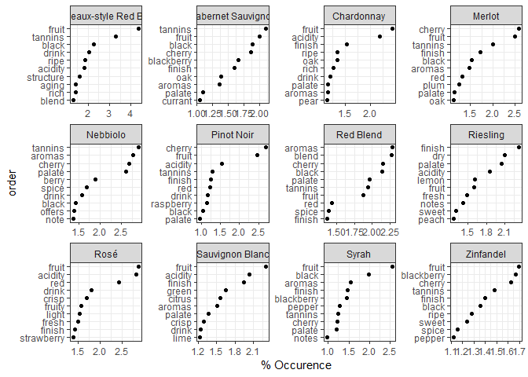
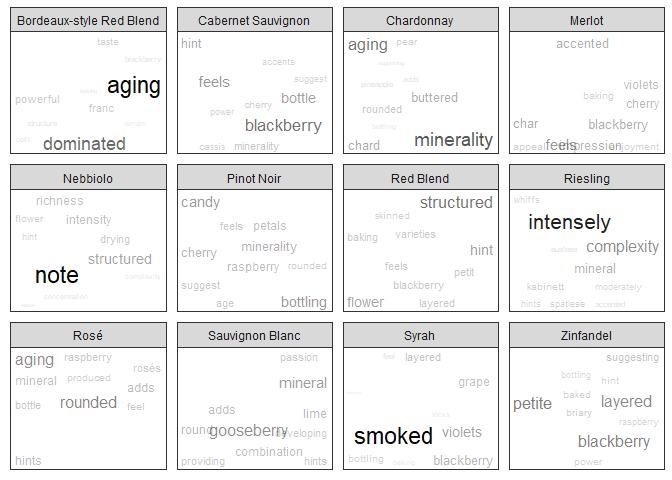

### Summary

With over 100,000 wine reviews to play with, I try to find words useful for describing different types of wine to make up for my unrefined palate. Given a wine I've never had before, but I know which type it is, I try to find both words that are common to describing that variety, and more subtle words to describe it if I feel like going out on a limb. I additionally create some word clouds of different wines by variety; these facetted plots are out of reach of the `wordcloud` library but done passably by extending `ggrepel`.

### Introduction

One of my favorite times of the week is Saturday evenings, when I share a bottle of wine with my girlfriend and we spend time talking or watching a show or movie. Unfortunately, my palate is not attuned to the subtleties of wine, especially not the $4 bottle we invariably drink as frugal students. She grew up smelling and tasting different wine varieties and does quite well picking out individual flavors and I can tell varieties of wine apart during a tasting, but definitely not whether I'm getting aromas of raspberries or blackberries in the wine at hand. Tired of this cluelessness, and after finding a dataset on Kaggle with over 100,000 reviews of different wines I figured I can use the power of crowdsourcing to help me out a bit.

There were three main goals of this text-mining exercise:

-   to identify what words go with what wines (i.e., what words should I be saying when drinking a Merlot vs a Cab Sauv)

-   to be able to go out on a limb and casually mention some more subtle or less obvious qualities, aromas, or flavors of the specific wine

-   make a word cloud for each type of wine, as more of an artistic data visualization endeavour

This task is well suited for a 'bag of words' approach since I'm not interested in the semantics or understanding of reviews themselves. What I need for the first goal is the most frequent words for each variety, and for the second I need a measure of how commonly a word is used for wine variety compared to other wine varieties. This slightly more nuanced approach lets one pick out distinguishing characteristics for each text in a corpus, and one of the best ways to do that is by using TF-IDF. TF-IDF (Term Frequency - Inverse Document Frequency) is a measure of how common a word in one document is compared to the other documents. Common words in English such as `the` or `and` show up in practically every document and so usually have a TF-IDF score of 0. These words are also known as stop words and we usually filter them out of any text before beginning text mining. Words with higher TF-IDF scores in a text are more distinctive to that text.

Other words are specific to the text domain. We'd expect words such as `wine`, `flavor`, `aroma` to appear frequently in a set of wine reviews across the different varieties, while the individual subtleties such as `oaky` flavor or a `mineral` aspect are more particular to the type of wine.

Data Import
-----------

``` r
library(readr)
library(dplyr)
library(stringr)
library(ggplot2)
library(ggrepel)
library(tidytext)

wine <- read_csv("Wine 130k reviews.csv") %>%
  select(-X1) %>% # this is a row number column and can be dropped
  distinct()
```

Though there are ~130,000 reviews, there are about ~120,000 unique ones.

``` r
wine %>%
  mutate(country = as.factor(country), 
         designation = as.factor(designation),
         province = as.factor(province),
         region_1 = as.factor(region_1),
         region_2 = as.factor(region_2),
         taster_name = as.factor(taster_name),
         taster_twitter_handle = as.factor(taster_twitter_handle),
         title = as.factor(title),
         variety = as.factor(variety),
         winery = as.factor(winery)) %>%
  summary(.)
```

    ##      country      description              designation        points      
    ##  US      :50457   Length:119988      Reserve     : 1871   Min.   : 80.00  
    ##  France  :20353   Class :character   Estate      : 1223   1st Qu.: 86.00  
    ##  Italy   :17940   Mode  :character   Reserva     : 1176   Median : 88.00  
    ##  Spain   : 6116                      Riserva     :  647   Mean   : 88.44  
    ##  Portugal: 5256                      Estate Grown:  567   3rd Qu.: 91.00  
    ##  (Other) :19807                      (Other)     :79959   Max.   :100.00  
    ##  NA's    :   59                      NA's        :34545                   
    ##      price               province                     region_1    
    ##  Min.   :   4.00   California:33656   Napa Valley         : 4174  
    ##  1st Qu.:  17.00   Washington: 7965   Columbia Valley (WA): 3795  
    ##  Median :  25.00   Bordeaux  : 5556   Russian River Valley: 2862  
    ##  Mean   :  35.62   Tuscany   : 5391   California          : 2468  
    ##  3rd Qu.:  42.00   Oregon    : 4929   Paso Robles         : 2155  
    ##  Max.   :3300.00   (Other)   :62432   (Other)             :84974  
    ##  NA's   :8395      NA's      :   59   NA's                :19560  
    ##               region_2                taster_name   
    ##  Central Coast    :10233   Roger Voss       :23560  
    ##  Sonoma           : 8390   Michael Schachner:14046  
    ##  Columbia Valley  : 7466   Kerin O’Keefe    : 9697  
    ##  Napa             : 6369   Paul Gregutt     : 8868  
    ##  Willamette Valley: 3142   Virginie Boone   : 8708  
    ##  (Other)          :11169   (Other)          :30192  
    ##  NA's             :73219   NA's             :24917  
    ##   taster_twitter_handle
    ##  @vossroger  :23560    
    ##  @wineschach :14046    
    ##  @kerinokeefe: 9697    
    ##  @paulgwine  : 8868    
    ##  @vboone     : 8708    
    ##  (Other)     :25663    
    ##  NA's        :29446    
    ##                                                                 title       
    ##  Gloria Ferrer NV Sonoma Brut Sparkling (Sonoma County)            :     9  
    ##  Segura Viudas NV Aria Estate Extra Dry Sparkling (Cava)           :     7  
    ##  Segura Viudas NV Extra Dry Sparkling (Cava)                       :     7  
    ##  Bailly-Lapierre NV Brut  (Crémant de Bourgogne)                   :     6  
    ##  Gloria Ferrer NV Blanc de Noirs Sparkling (Carneros)              :     6  
    ##  J Vineyards & Winery NV Brut Rosé Sparkling (Russian River Valley):     6  
    ##  (Other)                                                           :119947  
    ##                      variety                     winery      
    ##  Pinot Noir              :12278   Wines & Winemakers:   211  
    ##  Chardonnay              :10868   Williams Selyem   :   204  
    ##  Cabernet Sauvignon      : 8840   Testarossa        :   201  
    ##  Red Blend               : 8243   DFJ Vinhos        :   200  
    ##  Bordeaux-style Red Blend: 6471   Louis Latour      :   192  
    ##  (Other)                 :73287   Georges Duboeuf   :   186  
    ##  NA's                    :    1   (Other)           :118794

Some notes about the dataset:
-----------------------------

-   The majority of wines in the dataset are from the United States (50k) and most of those are from California (33.5k). In total there are 44 countries represented

-   Wines all ranged from 80 to 100 points, even though price ranged four orders of magnitude ($4 - $3300)

-   One taster was responsile for 20% of all the reviews!

-   Wine names and wineries show an fairly even distribution (there are no wines with an outsized rating frequency)

-   Pinot Noir is the most commonly rated wine, though there are 708 varieties

-   There are some data quality issues (e.g., California is listed as both a province and a region\_1). This isn't relevant to my analysis but would need to be fixed if I were going in another direction

Grouping descriptions of varieties together
-------------------------------------------

Since right now I'm only drinking popular, easily-accessible wines (and I only have finite screen space for my plots), I'm going to restrict myself to the most commonly rated wines.

### Filtering the top most rated wine varieties

``` r
wine_vars_num <- 12

top_vars <- wine %>%
  group_by(variety) %>%
  summarise(N = n()) %>%
  top_n(wine_vars_num, N) %>%
  mutate(variety = as.character(variety)) %>%
  pull(variety)
```

This returns a vector of the most popular (most-reviewed) wines with length 12. These wines are: Bordeaux-style Red Blend, Cabernet Sauvignon, Chardonnay, Merlot, Nebbiolo, Pinot Noir, Red Blend, Riesling, Rosé, Sauvignon Blanc, Syrah, Zinfandel

### Getting the descriptions for each of these varieties

I filter the dataset so that the variety is one of the popular ones found above, and then collapse all of the users' descriptions into one long string ('bag of words') per variety of wine.

``` r
variety_descriptions <- wine %>%
  filter(variety %in% top_vars) %>%
  group_by(variety) %>%
  mutate(description = paste(description, collapse = " "),
         num_reviews = n()) %>% 
  select(variety, description, num_reviews) %>%
  distinct(variety, .keep_all = TRUE) %>%
  ungroup()
```

These varities have been described extensively: below is the number of characters in the total description of these wines.

``` r
data_frame(Variety = variety_descriptions$variety,
           Reviews = variety_descriptions$num_reviews,
           Nchar = nchar(variety_descriptions$description),
           Description.Head = substr(variety_descriptions$description, start = 1, stop = 70)) %>%
  arrange(Variety)
```

    ## # A tibble: 12 x 4
    ##    Variety         Reviews  Nchar Description.Head                        
    ##    <chr>             <int>  <int> <chr>                                   
    ##  1 Bordeaux-style~    6471 1.56e6 A blend of Merlot and Cabernet Franc, t~
    ##  2 Cabernet Sauvi~    8840 2.24e6 Soft, supple plum envelopes an oaky str~
    ##  3 Chardonnay        10868 2.51e6 Building on 150 years and six generatio~
    ##  4 Merlot             2896 6.61e5 This wine from the Geneseo district off~
    ##  5 Nebbiolo           2607 6.93e5 Slightly backward, particularly given t~
    ##  6 Pinot Noir        12278 3.15e6 "Much like the regular bottling from 20~
    ##  7 Red Blend          8243 2.17e6 Ripe aromas of dark berries mingle with~
    ##  8 Riesling           4773 1.21e6 Pineapple rind, lemon pith and orange b~
    ##  9 Rosé               3220 6.79e5 "Pale copper in hue, this wine exudes p~
    ## 10 Sauvignon Blanc    4575 1.04e6 This shows a tart, green gooseberry fla~
    ## 11 Syrah              3828 9.96e5 Baked red cherry, crushed clove, iron a~
    ## 12 Zinfandel          2530 5.94e5 A healthy addition of 13% Petite Sirah ~

However, the bag of words for each variety is tricky to deal with. To make the analysis easier, the data needs to be tidied: each row in the dataframe should correspond to a {variety, word} observation. Since I'm interested in word frequency for each variety I also aggregate the counts here.

``` r
unnested_tokens <- variety_descriptions %>%
  unnest_tokens(word, description) %>%
  group_by(variety, word) %>%
  count()
```

This provides a very long dataframe: 91,965 rows and 3 columns.

#### Removing Stop Words

I then remove common English words (`the`, `and`, `but`) from the reviews. These words are known as stop words and don't really contribute anything to the differences in description between the wines. Additionally, it's common in reviews to cite the name of what is being reviewed; I want to remove the most common words that could be thought of as wine-specific stop words: the names of the wines, and two throw-in words common in most of the reviews. I also remove numeric values: years, prices, ordinal numbers.

``` r
wine_words <- c("wine", "flavors")
wine_types <- c(unique(tolower(wine$variety)), 
                "barolo", "barbaresco", "cab", "sauv", "pinot", "noir", 
                "sb", "blanc", "syrahs", "zin", "zins", "zin's")

without_stop_words <- unnested_tokens %>%
  anti_join(tidytext::stop_words) %>%
  filter(!word %in% regex(wine_words) & 
          ! word %in% regex(wine_types) &
         !str_detect(word, "[[:digit:]]")) %>%
  ungroup() %>%
  mutate(variety = as.character(variety))

head(without_stop_words)
```

    ## # A tibble: 6 x 3
    ##   variety                  word            n
    ##   <chr>                    <chr>       <int>
    ## 1 Bordeaux-style Red Blend à               2
    ## 2 Bordeaux-style Red Blend aaron           4
    ## 3 Bordeaux-style Red Blend abbot           1
    ## 4 Bordeaux-style Red Blend abbreviated     3
    ## 5 Bordeaux-style Red Blend ability         6
    ## 6 Bordeaux-style Red Blend abound          7

Sometimes the same word is repeated with a slighly different ending (e.g. `abound` vs `abounds`, or `strawberry` vs `strawberries`). The process of removing those is called de-stemming. De-stemming a word can oftentimes return a non-word string back; I do want to keep the full words. To do so, I create a new variable for the word stem and count the number of observations of that word stem by variety. I then keep the original word with the highest count that has that word stem. Thus `strawberry` and `strawberries` are counted as the same word and I can include their sum frequency of occurence in just the word `strawberry`.

``` r
stemmed_words <- without_stop_words %>%
  mutate(word_stem = SnowballC::wordStem(word)) %>%
  group_by(word_stem, variety) %>%
  mutate(N = sum(n)) %>%
  ungroup() %>%
  group_by(variety, word_stem) %>%
  filter(n == max(n)) %>%
  distinct(variety, word_stem, .keep_all = TRUE) %>%
  select(-n, -word_stem)
```

Words I need to know for each variety
-------------------------------------

The most common 10 words per variety is a good starting point for me so I can start to sound like I have some idea about the wines I'm tasting. Of course, this is incumbent upon me knowing what kind of wine I'm drinking (I'll have to deal with not knowing the other type some other way).

I had an issue where the words weren't ordering within each individual facet, but found the ingenous trick by drsimonj (<https://drsimonj.svbtle.com/ordering-categories-within-ggplot2-facets>) of using the `dplyr::row_number()` function to order the words within each group.

``` r
wine_subset <- stemmed_words %>%
  group_by(variety) %>%
  mutate(Frac = 100 *  N/sum(N)) %>%
  top_n(10, Frac) %>%
  ungroup() %>%
  arrange(variety, Frac) %>%
  mutate(order = row_number())

ggplot(wine_subset, aes(x = order, y = Frac)) + 
  theme_bw() + 
  theme(panel.grid.minor.y = element_blank()) + 
  geom_point() + 
  scale_x_continuous(breaks = wine_subset$order, 
                     labels = wine_subset$word) + 
  facet_wrap(.~ variety, scales = "free") + 
  coord_flip() + 
  labs(y = "% Occurence")
```



There are some words common across most of these varieties: `fruit`, `tannins`, and `cherry` are frequent in the wine varieties I drink most often (Merlot, Cabernet Sauvignon, Pinot Noir). These word show up between 2% - 2.5% of the time in the reviews. Next time I'm drinking one of those, I'll make sure to casually use one of those words every so often!

On the white wine (Chardonnay Riesling, Sauvignon Blanc, Zinfandel) or lighter (Rose) side, I'm pretty safe declaring I get hints of `fruit` and `acidity`. However, I'll have to be careful to remember that only Chardonnays typically have that `oak`y finish.

Distinguishing words between varieties
--------------------------------------

Some words are very common between varieties (`fruit`, `cherry`, `tannins`) and so can't be used to distinguish between them. Meanwhile some words don't show up frequently outside of that variety (Cabernet Sauvignon and `currant`, Chardonnay and `pear`, Merlot and `plum`, etc). These words are better at distinguishing different wine varieties than common shared words, so it would be nice to distinguish them better. One way of quantifying this is through TF-IDF (text-frequency/inter-document frequency). Words that are common in each corpus (here defined as a variety) are weighted low, while words that are frequent in one corpus but not in others are weighted higher.

For personal use, I again choose 10 of the most distinguishing words, but for the word cloud I choose a more extensive 50.

``` r
shorter_tf_idf <- stemmed_words %>%
  bind_tf_idf(word, variety, N) %>%
  group_by(variety) %>%
  top_n(10, tf_idf) %>%
  ungroup() %>%
  arrange(variety, tf_idf) %>%
  mutate(order = row_number())

ggplot(shorter_tf_idf, aes(x = order, y = tf_idf)) + 
  theme_bw() + 
  theme(panel.grid.minor.y = element_blank()) + 
  geom_point() + 
  scale_x_continuous(breaks = shorter_tf_idf$order, 
                     labels = shorter_tf_idf$word) + 
  facet_wrap(.~ variety, scales = "free") + 
  coord_flip() + 
  labs(y = "TF-IDF")
```


Some interesting words emerge from this. Bordeaux-style reds are characterized as `powerful`, or `dominat[ing]`, Merlots have a `char` or `blackberry` element, Sauvignon Blancs are associated with `gooseberry`, and Syrahs have a `smoked` aspect (that I actually have been able to taste myself). Many of the wines have a floral quality as well -- `flower`, `petals`, and `violets` all make an appearance.

Word cloud
----------

### Libraries

While there exists a great wordcloud library in R (suitably named `wordcloud`), it uses base R graphics and doesn't support features such as facetting by variety that I'm looking for. On the other hand, ggplot2 does not natively have a wordcloud ability, but there is a workaround with `geom_text()` and especially the extremely helpful extension `ggrepel::geom_text_repel()`. With some inspiration from <http://mhairihmcneill.com/blog/2016/04/05/wordclouds-in-ggplot.html> and <https://bridgewater.wordpress.com/2012/04/16/word-cloud-alternatives/> I've created my own way of using `ggplot2` and `ggrepel`.

Mhairi set the x and y coordinates to 1, relying on `ggrepel::geom_text_repel()` to nudge the text into the appropriate positions, but the wordclouds were a little too diffuse for me. Instead I sample the normal distribution for both x and y coordinates, leading to a tight bunch in the center with some words farther on the boundaries of the screen.

I also size the words (and later set the transparency) by their fraction of their variety's TF-IDF. Words that are important for each variety are therefore larger and easier to see. The alternative way of sizing is to ignore variety and simply have the most distinctive words stand out. My current method gives each wine variety more parity; I may decide to switch over later.

I add an angle to the words as well (uniform randoml sampling of 0 or 90 degree rotation) but I got too much overlap in the labels so I've taken out that argument from the plotting function now.

``` r
wine_plot_data <- stemmed_words %>% 
  bind_tf_idf(word, variety, N) %>%
  group_by(variety) %>%
  top_n(10, tf_idf) %>%
  ungroup() %>%
  select(-tf, -idf) %>%
  mutate(x = rnorm(n = nrow(.)),
         y = rnorm(n = nrow(.)),
         angle = sample(x = c(0, 90), size = nrow(.), replace = TRUE)) %>%
  group_by(variety) %>%
  mutate(size = tf_idf/sum(tf_idf))
```

The plot
--------

By specifying the segment size is 0 and the point padding is NA, I get non-overlapping text (as much as is possible in the number of iterations).

``` r
ggplot(wine_plot_data, aes(x, y, label = word)) + 
  theme_bw() + 
  geom_text_repel(aes(size = size, alpha = size), segment.alpha = 0, # angle = angle
                  force = 10, max.iter = 25000, point.padding = NA) + 
  facet_wrap(~variety, scales = "free") + 
  theme(axis.text = element_blank(),
        panel.grid = element_blank(),
        axis.ticks = element_blank(),
        axis.title = element_blank()) +
  guides(size = FALSE) + 
  guides(alpha = FALSE)
```


