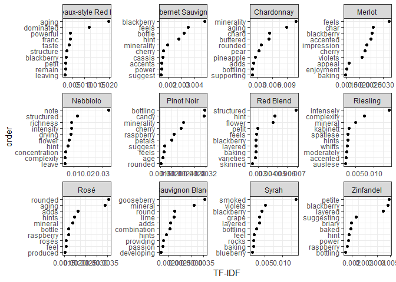
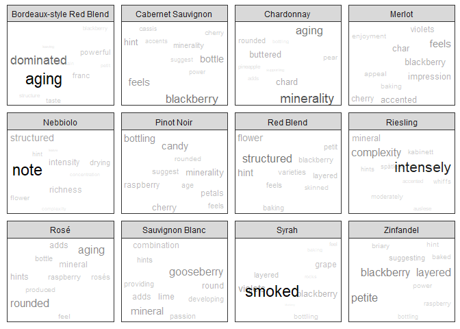

Wine Word Clouds
================
Konrad Miziolek
August 18, 2018

``` r
library(readr)
library(dplyr)
library(ggplot2)
library(ggrepel)
library(tidytext)
library(stringr)
```

Data Import
-----------

Though there are ~150,000 reviews, there are only ~95,000 unique ones.

``` r
wine <- read_csv("Wine 150k reviews.csv") %>%
  select(-X1) %>%
  mutate(country = as.factor(country), 
         province = as.factor(province),
         region_1 = as.factor(region_1),
         region_2 = as.factor(region_2),
         variety = as.factor(variety),
         winery = as.factor(winery)) %>%
  distinct()
```

``` r
summary(wine)
```

    ##     country      description        designation            points      
    ##  US     :40544   Length:97851       Length:97851       Min.   : 80.00  
    ##  Italy  :14850   Class :character   Class :character   1st Qu.: 86.00  
    ##  France :14459   Mode  :character   Mode  :character   Median : 88.00  
    ##  Spain  : 5443                                         Mean   : 87.96  
    ##  Chile  : 3735                                         3rd Qu.: 90.00  
    ##  (Other):18817                                         Max.   :100.00  
    ##  NA's   :    3                                                         
    ##      price                   province                     region_1    
    ##  Min.   :   4.00   California    :28800   Napa Valley         : 4131  
    ##  1st Qu.:  16.00   Washington    : 6479   Columbia Valley (WA): 3334  
    ##  Median :  25.00   Tuscany       : 4611   Russian River Valley: 2302  
    ##  Mean   :  33.66   Bordeaux      : 4434   California          : 2228  
    ##  3rd Qu.:  40.00   Northern Spain: 3196   Mendoza             : 2199  
    ##  Max.   :2300.00   (Other)       :50328   (Other)             :67725  
    ##  NA's   :8720      NA's          :    3   NA's                :15932  
    ##              region_2                         variety     
    ##  Central Coast   : 8378   Pinot Noir              : 9283  
    ##  Sonoma          : 7174   Chardonnay              : 9163  
    ##  Columbia Valley : 6084   Cabernet Sauvignon      : 8272  
    ##  Napa            : 5869   Red Blend               : 6485  
    ##  California Other: 2262   Bordeaux-style Red Blend: 5176  
    ##  (Other)         : 9724   Sauvignon Blanc         : 4037  
    ##  NA's            :58360   (Other)                 :55435  
    ##                    winery     
    ##  Williams Selyem      :  235  
    ##  Testarossa           :  171  
    ##  Chateau Ste. Michelle:  156  
    ##  Columbia Crest       :  152  
    ##  DFJ Vinhos           :  148  
    ##  Concha y Toro        :  132  
    ##  (Other)              :96857

Most variables are non-sparse, i.e. have many observations. Notably price is missing from ~ 9% of the observations. There are some other issues to address as well: California is listed as both a province and a region\_1; I'm sure that there are other regions that have simliar issues. For more detailed analyses of region-based data that will have to be dealt with. However, since I'm primarily interested in doing a wordcloud for now, that is the direction I'll be going below.

Grouping descriptions of varieties together
-------------------------------------------

My end goal is to have a word cloud for different varieties of wine. Because there are 632 varieties, and only finite screen space, I've chosen to select only the top 12 most rated wines.

### Filtering the top 12-most rated wine varieties

This returns a vector of the most popular (most-reviewed) wines with length 12

``` r
top_12_vars <- wine %>%
  group_by(variety) %>%
  summarise(N = n()) %>%
  top_n(12, N) %>%
  mutate(variety = as.character(variety)) %>%
  pull(variety)
```

### Getting the descriptions for each of these varieties

I filter the dataset so that the variety is one of the popular ones found above, and then collapse all of the users' descriptions into one long string ('bag of words') per variety of wine.

``` r
variety_descriptions <- wine %>%
  filter(variety %in% top_12_vars) %>%
  group_by(variety) %>%
  mutate(description = paste(description, collapse = " "),
         num_reviews = n()) %>% 
  select(variety, description, num_reviews) %>%
  distinct(variety, .keep_all = TRUE) %>%
  ungroup()
```

These varities have been described extensively: below is the number of characters in the total description of these wines.

``` r
data_frame(Variety = variety_descriptions$variety,
           Reviews = variety_descriptions$num_reviews,
           Nchar = nchar(variety_descriptions$description)) %>%
  arrange(Variety)
```

    ## # A tibble: 12 x 3
    ##    Variety                  Reviews   Nchar
    ##    <fct>                      <int>   <int>
    ##  1 Bordeaux-style Red Blend    5176 1198079
    ##  2 Cabernet Sauvignon          8272 2110810
    ##  3 Chardonnay                  9163 2091469
    ##  4 Malbec                      1968  503815
    ##  5 Merlot                      3178  724382
    ##  6 Pinot Noir                  9283 2303185
    ##  7 Red Blend                   6485 1708087
    ##  8 Riesling                    3585  889063
    ##  9 Sangiovese                  2153  531750
    ## 10 Sauvignon Blanc             4037  918587
    ## 11 Syrah                       3663  936882
    ## 12 Zinfandel                   2409  538312

However, the bag of words for each variety is tricky to deal with. To make the analysis easier, the data needs to be tidied: each row in the dataframe should correspond to a {variety, word} observation. Since I'm interested in word frequency for each variety I also aggregate the counts here.

``` r
unnested_tokens <- variety_descriptions %>%
  unnest_tokens(word, description) %>%
  group_by(variety, word) %>%
  count()
```

This provides a very long dataframe: 90,038 rows and 3 columns.

I then remove common English words ('the', 'and', 'but') from the reviews. These words are known as stop words and don't really contribute anything to the differences in description between the wines. Additionally, it's common in reviews to cite the name of what is being reviewed; I want to remove the most common words that could be thought of as wine-specific stop words: the names of the wines, and two throw-in words common in most of the reviews. I also remove numeric values: years, prices, ordinal numbers.

``` r
wine_words <- c("wine", "flavors")
wine_types <- c(unique(tolower(wine$variety)), "pinot", "noir", "syrahs")

without_stop_words <- unnested_tokens %>%
  anti_join(tidytext::stop_words) %>%
  filter(!word %in% regex(wine_words) & 
          ! word %in% regex(wine_types) &
         !str_detect(word, "[[:digit:]]")) %>%
  ungroup() %>%
  mutate(variety = as.character(variety))

head(without_stop_words)
```

    ## # A tibble: 6 x 3
    ##   variety                  word        n
    ##   <chr>                    <chr>   <int>
    ## 1 Bordeaux-style Red Blend à           1
    ## 2 Bordeaux-style Red Blend aaron       1
    ## 3 Bordeaux-style Red Blend ability     5
    ## 4 Bordeaux-style Red Blend abound      6
    ## 5 Bordeaux-style Red Blend abounds     1
    ## 6 Bordeaux-style Red Blend abreu's     1

Sometimes the same word is repeated with a slighly different ending (e.g. abound vs abounds, or strawberry vs strawberries). The process of removing those is called de-stemming. De-stemming a word can oftentimes return a non-word string back; I do want to keep the full words. To do so, I create a new variable for the word stem and count the number of observations of that word stem by variety. I then keep the original word with the highest count that has that word stem. Thus "strawberry" and "strawberries" are counted as the same word and I can include their sum frequency of occurence in just the word "strawberry."

``` r
stemmed_words <- without_stop_words %>%
  mutate(word_stem = SnowballC::wordStem(word)) %>%
  group_by(word_stem, variety) %>%
  mutate(N = sum(n)) %>%
  ungroup() %>%
  group_by(variety, word_stem) %>%
  filter(n == max(n)) %>%
  distinct(variety, word_stem, .keep_all = TRUE) %>%
  select(-n, -word_stem)
```

Most common words by variety
----------------------------

``` r
wine_subset <- stemmed_words %>%
  group_by(variety) %>%
  top_n(10, N)

ggplot(wine_subset, aes(x = reorder(word, N), y = N)) + 
  geom_bar(stat = "identity") + 
  scale_y_log10() + 
  facet_wrap(.~ variety, scales = "free") + 
  coord_flip() + 
  labs(x = "Word")
```



Wordcloud
---------

Some words are very common between varieties (fruit, cherry, tannins) and so would be boring to see on a wordcloud for each wine. Meanwhile some words don't show up frequently outside of that variety (Chardonnay and pineapple, Sauvignon Blanc and grapefruit, Syrah and pepper, etc). These words are better at distinguishing different wine varieties than common shared words, so it would be nice to distinguish them better. One way of quantifying this is through TF-IDF (text-frequency/inter-document frequency). Words that are common in each corpus (here defined as a variety) are weighted low, while words that are frequent in one corpus but not in others are weighted higher. For each variety, the 75 words with the highest TF-IDF score are chosen.

``` r
wine_tf_idf <- stemmed_words %>%
  bind_tf_idf(word, variety, N) %>%
  group_by(variety) %>%
  top_n(75, tf_idf) %>%
  ungroup() 
```

### Wordcloud libraries

While there exists a great wordcloud library in R (suitably named `wordcloud`), it uses base R graphics and doesn't support features such as facetting by variety that I'm looking for. On the other hand, ggplot2 does not natively have a wordcloud ability, but there is a workaround with `geom_text()` and especially the extremely helpful extension `ggrepel::geom_text_repel()`. With some inspiration from <http://mhairihmcneill.com/blog/2016/04/05/wordclouds-in-ggplot.html> and <https://bridgewater.wordpress.com/2012/04/16/word-cloud-alternatives/> I've created my own way of using `ggplot2` and `ggrepel`.

Mhairi set the x and y coordinates to 1, relying on \`ggrepel::geom\_text\_repel()\`\` to nudge the text into the appropriate positions, but the wordclouds were a little too diffuse for me. Instead I sample the normal distribution for both x and y coordinates, leading to a tight bunch in the center with some words farther on the boundaries of the screen.

I also size the words (and later set the transparency) by their fraction of their variety's TF-IDF. Words that are important for each variety are therefore larger and easier to see. The alternative way of sizing is to ignore variety and simply have the most distinctive words stand out. My current method gives each wine variety more parity; I may decide to switch over later.

I add an angle to the words as well (uniform randoml sampling of 0 or 90 degree rotation) but I got too much overlap in the labels so I've taken out that argument from the plotting function now.

``` r
wine_plot_data <- wine_tf_idf %>%
  select(-tf, -idf) %>%
  mutate(x = rnorm(n = nrow(.)),
         y = rnorm(n = nrow(.)),
         angle = sample(x = c(0, 90), size = nrow(.), replace = TRUE)) %>%
  group_by(variety) %>%
  mutate(size = tf_idf/sum(tf_idf))
```

The plot
--------

By specifying the segment size is 0 and the point padding is NA, I get non-overlapping text (as much as is possible in the number of iterations).

``` r
ggplot(wine_plot_data, aes(x, y, label = word)) + 
  theme_bw() + 
  geom_text_repel(aes(size = size, alpha = size), segment.alpha = 0, # angle = angle
                  force = 10, max.iter = 25000, point.padding = NA) + 
  facet_wrap(~variety, scales = "free") + 
  theme(axis.text = element_blank(),
        panel.grid = element_blank(),
        axis.ticks = element_blank(),
        axis.title = element_blank()) +
  guides(size = FALSE) + 
  guides(alpha = FALSE)
```


